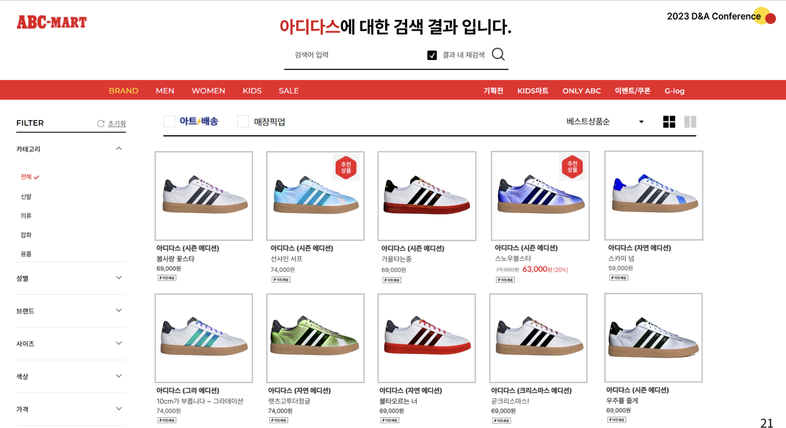

<h1 align = "center"> 3D Shoes Customization </h1>

<h3 align="center"> D&A Conference Project  (2023-08 ~ 2023-11) </h3>


<br>

#### Why I do this Project?
I want anyone to make easily own customization shoes. And I hope to made 3d shoes to be a real shoes in the future by developing 3D printing.

<br>


<h3 align="left"> Method </h3>

#### 1. Make the mask of the shoes by using Segmentation
    -  Sometimes the masks are inaccurate so you have to check and trim it.


#### 2. Apply your style that you want to the shoe by Style Transfer Model


#### 3. Convert shoe to 3D object by 3D Reconstruction Model


<br>

<h4 align="left"> Reference Code </h4>

[Segment anything](https://github.com/facebookresearch/segment-anything)
```
@article{kirillov2023segany,
  title={Segment Anything},
  author={Kirillov, Alexander and Mintun, Eric and Ravi, Nikhila and Mao, Hanzi and Rolland, Chloe and Gustafson, Laura and Xiao, Tete and Whitehead, Spencer and Berg, Alexander C. and Lo, Wan-Yen and Doll{\'a}r, Piotr and Girshick, Ross},
  journal={arXiv:2304.02643},
  year={2023}
}
```

[CAP-VSTNet](https://github.com/linfengWen98/CAP-VSTNet)
```
@inproceedings{wen2023cap,
  title={CAP-VSTNet: Content Affinity Preserved Versatile Style Transfer},
  author={Wen, Linfeng and Gao, Chengying and Zou, Changqing},
  booktitle={Proceedings of the IEEE/CVF Conference on Computer Vision and Pattern Recognition},
  pages={18300--18309},
  year={2023}
}
```

[One-2-3-45](https://github.com/One-2-3-45/One-2-3-45)
```
@article{liu2023one2345,
  title={One-2-3-45: Any single image to 3d mesh in 45 seconds without per-shape optimization},
  author={Liu, Minghua and Xu, Chao and Jin, Haian and Chen, Linghao and Xu, Zexiang and Su, Hao and others},
  journal={arXiv preprint arXiv:2306.16928},
  year={2023}
}
```

[DreamGaussian](https://github.com/dreamgaussian/dreamgaussian)
```
@article{tang2023dreamgaussian,
  title={DreamGaussian: Generative Gaussian Splatting for Efficient 3D Content Creation},
  author={Tang, Jiaxiang and Ren, Jiawei and Zhou, Hang and Liu, Ziwei and Zeng, Gang},
  journal={arXiv preprint arXiv:2309.16653},
  year={2023}
}
```
<br>


<br>
<div align="center">

<h2 align="center"> Demo Gif & transfered images </h2>

<br>

<p float="center">
  
</p>

</div>


<br>
<div align="center">



<br>


</div>


- **You can see the project through pdf file specifically.**