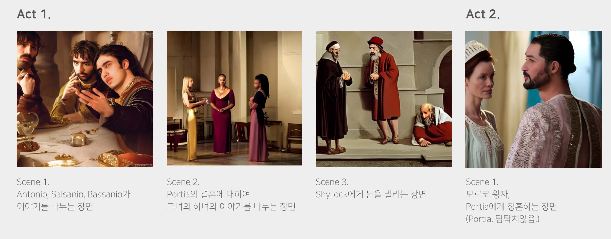
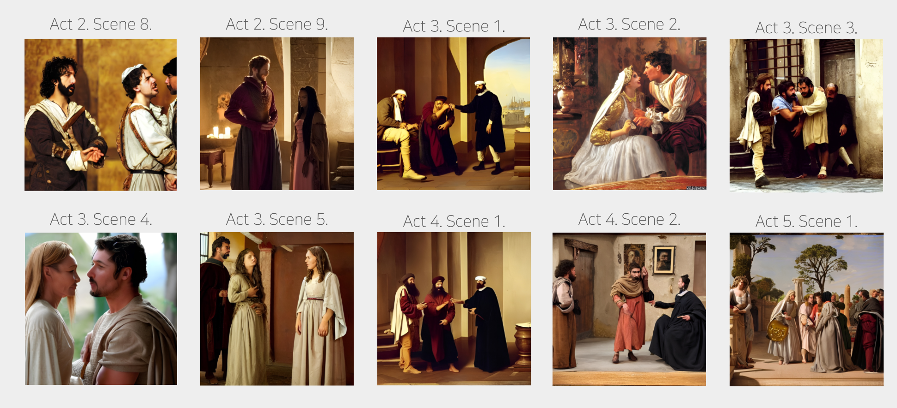
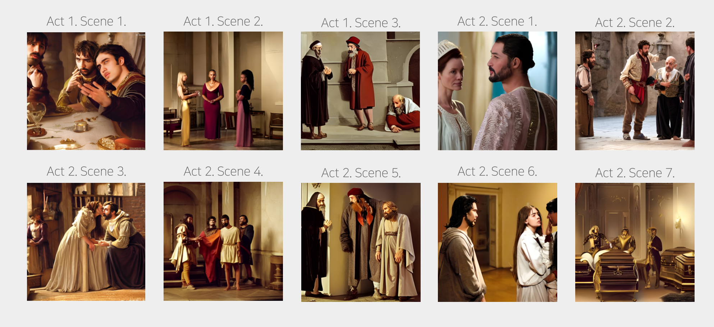

<h1 align = "center"> Generate Novel Scence </h1>

<h3 align="center"> D&A Conference Project  (2022-08 ~ 2022-11) </h3>


<br>

#### Why I do this Project?
When I read a book, Somethimes I imagine the place that main character live in or apperance of characters in books.

There are many books that just only have text. So if there are any images, I think that it was so nice. 

Imagine that we can see the characters in the novel we read.

<br>


<h3 align="left"> Method </h3>

#### 1. Summarize each chapter of the novel.
    -  if we didn't summarize the text, we can't any propoer image. Because too many text make image generator confuse.


#### 2. Generate Scence


#### 3. Retouch Image


<br>

<h4 align="left"> Reference Code </h4>

[BART](https://github.com/facebookresearch/fairseq/blob/main/examples/bart)
```
@article{lewis2019bart,
    title = {BART: Denoising Sequence-to-Sequence Pre-training for Natural
Language Generation, Translation, and Comprehension},
    author = {Mike Lewis and Yinhan Liu and Naman Goyal and Marjan Ghazvininejad and
              Abdelrahman Mohamed and Omer Levy and Veselin Stoyanov
              and Luke Zettlemoyer },
    journal={arXiv preprint arXiv:1910.13461},
    year = {2019},
}
```

[CTRL-SUM](https://huggingface.co/hyunwoongko/ctrlsum-cnndm)


[Stable Diffusion](https://github.com/huggingface/diffusers)
```
@misc{von-platen-etal-2022-diffusers,
  author = {Patrick von Platen and Suraj Patil and Anton Lozhkov and Pedro Cuenca and Nathan Lambert and Kashif Rasul and Mishig Davaadorj and Thomas Wolf},
  title = {Diffusers: State-of-the-art diffusion models},
  year = {2022},
  publisher = {GitHub},
  journal = {GitHub repository},
  howpublished = {\url{https://github.com/huggingface/diffusers}}
}
```

[GFPGAN](https://github.com/TencentARC/GFPGAN)
```
@InProceedings{wang2021gfpgan,
    author = {Xintao Wang and Yu Li and Honglun Zhang and Ying Shan},
    title = {Towards Real-World Blind Face Restoration with Generative Facial Prior},
    booktitle={The IEEE Conference on Computer Vision and Pattern Recognition (CVPR)},
    year = {2021}
}
```
<br>


<br>
<div align="center">

<h2 align="center"> Result Images in Merchant of Venice </h2>

<br>


</div>


<br>
<div align="center">



<br>



<br>



</div>


- **You can see the project through pdf file specifically.**