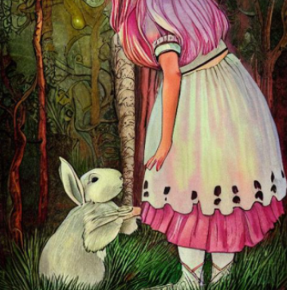
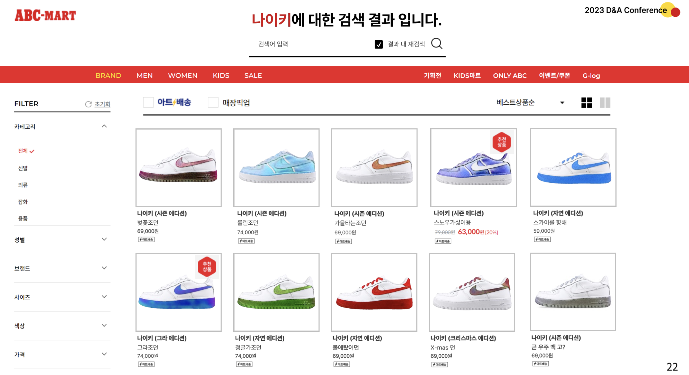

<h1 align = "center"> D&A Conference Project </h1>

### 1. Generate Novel Scence (2022.08 ~ 2022.11)

### 2. 3D Customized Shoe (2023.08 ~ 2023.11)

 

- I did two project at D&A Conference.

- These project are concentrated on showing and utilizing the AI. So, there are a few codes

- I particepated in the conference at twice at 3rd year of college and 4rd year of college

 

<h1 align="left"> Introduce </h1>

## 1. Generate Novel Scence

 

**Summarize Novel Chapter and generate scence through text data.**
 

[[PRESENTATION LINK]](https://www.youtube.com/watch?v=DWKVIOXZ92w&t=8s) [[PROJECT LINK]](https://github.com/Go-MinSeong/Conference/tree/main/Generate_Novel_Scenes) 

 

**Generated image in Alice in Wonderland**

 

 

## 2. 3D Customized Shoe

 

**Segmentation shoe and style transfer apply shoe and generate 3d shoe.**

[[PROJECT LINK]](https://github.com/Go-MinSeong/Conference/tree/main/3D_Customized_Shoe)

 

**Various transfered shoes**

